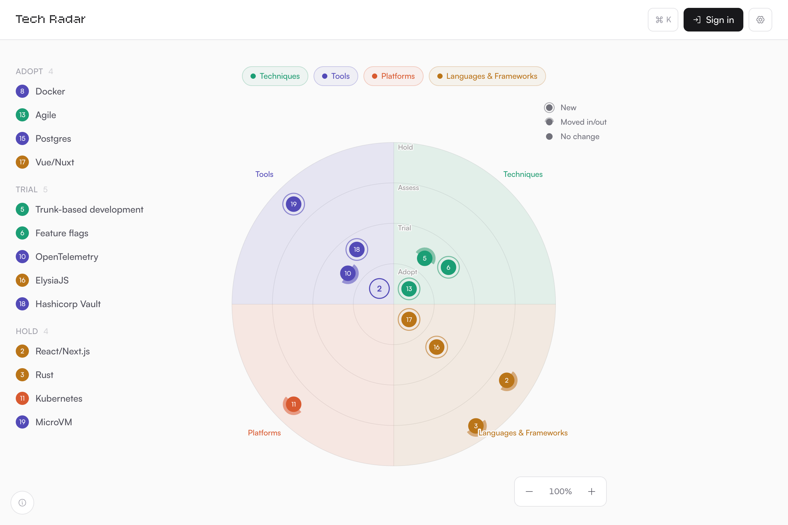

# Tech Radar

I first heard about tech radars on [A la French](https://open.spotify.com/show/27JsAiSutGZMJHC2TlPeBm) podcast, went digging, and found
[the OG radar from ThoughtWorks](https://www.thoughtworks.com/radar) along with the homegrown
versions from companies like [Zalando](https://opensource.zalando.com/tech-radar/).
I liked the idea of a single honest picture of what a team should use or hold, so I built this self-hosted one to run my own.



## Quick start

Run it open (anyone can view and edit). Good for a trusted network or a quick try:

```sh
docker run -d --name techradar -p 3000:3000 -v techradar-data:/data \
  ghcr.io/marcaureln/techradar:latest
```

Open <http://localhost:3000> and follow the onboarding to name your radar.

> **Heads up:** in open mode there is no login, so anyone who can reach the URL can view
> **and** edit the radar. Only expose it on a trusted network, or turn on
> [secure mode](#secure-mode).

## Configuration

All configuration is through environment variables.

| Variable             | Required | Default                   | Description                                                              |
| -------------------- | -------- | ------------------------- | ------------------------------------------------------------------------ |
| `DATABASE_URL`       | no       | `file:/data/techradar.db` | SQLite connection string. The default points at the mounted volume.      |
| `PORT`               | no       | `3000`                    | HTTP port the server listens on.                                         |
| `SITE_URL`           | secure mode behind a proxy | inferred from request | Public URL (e.g. `https://radar.example.com`). Used to build the OAuth redirect URI. |
| `MCP_ENABLED`        | no       | `true`                    | Open mode only: set to `false` to disable the MCP server. In secure mode use the in-app toggle instead. |

## Secure mode

Tech Radar has no login of its own. Instead it delegates to an OAuth provider, and
**secure mode turns on automatically as soon as you configure one provider**. There is
no flag to set.

In secure mode:

- Anonymous visitors see the radar **read-only**: they can browse and search, but the
  add/edit/archive controls are hidden and write requests are rejected.
- Signed-in users whose email is in `EDITOR_EMAILS` get **full editing**.
- A signed-in user not in `EDITOR_EMAILS` stays read-only.

Configure **exactly one** provider. If more than one is configured the server refuses
to start, so the login path is never ambiguous.

### Provider configuration

| Variable                                                | Description                                                                 |
| ------------------------------------------------------- | --------------------------------------------------------------------------- |
| `SESSION_SECRET`                                        | Random string (>= 32 chars) used to seal the login session cookie.          |
| `EDITOR_EMAILS`                                               | Comma-separated list of emails allowed to edit. Empty = any signed-in user can edit. |
| `GOOGLE_CLIENT_ID` / `GOOGLE_CLIENT_SECRET`             | Enable Google sign-in.                                                     |
| `MICROSOFT_CLIENT_ID` / `MICROSOFT_CLIENT_SECRET`       | Enable Microsoft sign-in.                                                  |
| `GITHUB_CLIENT_ID` / `GITHUB_CLIENT_SECRET`             | Enable GitHub sign-in.                                                     |
| `OIDC_CLIENT_ID` / `OIDC_CLIENT_SECRET` / `OIDC_ISSUER` | Enable any OpenID Connect provider (Authentik, Keycloak, Authelia, Okta, ...). `OIDC_ISSUER` is the issuer URL. |

Two things are required for OAuth to work:

- **Serve it over HTTPS** (e.g. behind a reverse proxy). The login cookies are `Secure`, so
  browsers drop them over plain HTTP and the sign-in never completes.
- **Set `SITE_URL`** to the public URL (e.g. `https://radar.example.com`), and register
  `SITE_URL/auth/<provider>` as the redirect/callback URI in your provider, where
  `<provider>` is `google`, `microsoft`, `github`, or `oidc`.

Once configured, the nav shows a **Sign in** button that redirects to your provider and
back to the radar.

## MCP server

Tech Radar exposes an [MCP](https://modelcontextprotocol.io/) endpoint at `/mcp` (Streamable
HTTP) so AI tools can work with the radar. It is **enabled by default**.

- In open mode it is on by default; set `MCP_ENABLED=false` to disable it.
- In secure mode an editor can turn it off from **Settings**.

**Read tools** (list, search, overview, due for review) are always available. **Write tools**
(create, update, archive, restore, mark reviewed) only work in secure mode and only for a request
that carries a token. Generate the token in **Settings** (an editor sees it there) and send it as
a Bearer header.

### Connect from Claude Code

```sh
claude mcp add --transport http techradar https://radar.example.com/mcp \
  --header "Authorization: Bearer <your-token>"
```

Or in `.mcp.json`:

```json
{
  "mcpServers": {
    "techradar": {
      "type": "http",
      "url": "https://radar.example.com/mcp",
      "headers": { "Authorization": "Bearer <your-token>" }
    }
  }
}
```

Without the header you still get the read tools; with a valid token the write tools appear too.

### Hosted assistants (claude.ai, Claude Desktop, ChatGPT)

These connect to remote MCP servers only through an interactive OAuth flow, which Tech Radar does
not implement. They cannot present the static token, so the write tools are out of reach from them.
For write access use Claude Code, or any MCP client that lets you set a custom `Authorization`
header.

## Development

```sh
pnpm install
pnpm db:migrate   # set up the local SQLite database
pnpm dev          # http://localhost:3000

pnpm test         # Vitest
pnpm build        # production build
```

Stack: Nuxt 4, Prisma + SQLite, TanStack Vue Query, Tailwind v4, shadcn-vue/reka-ui.
